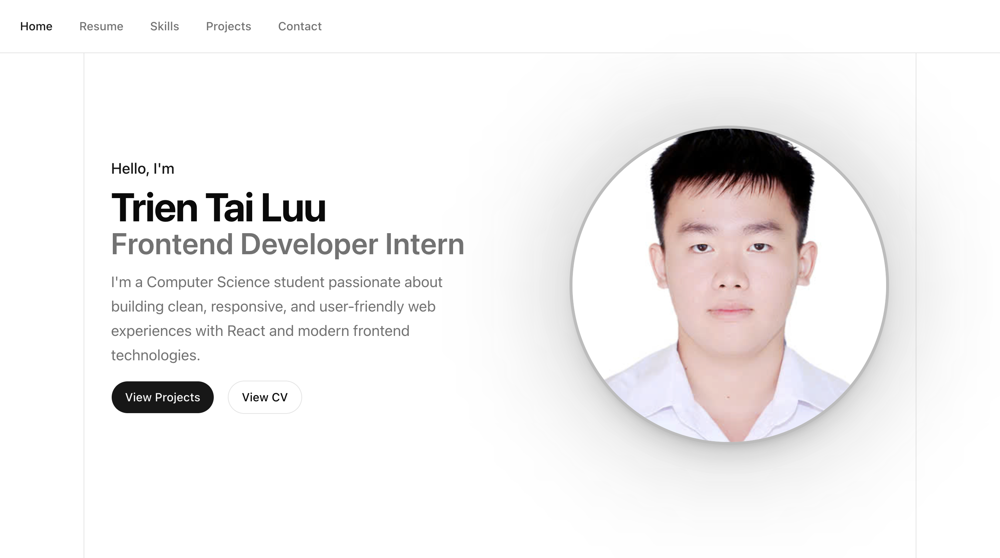
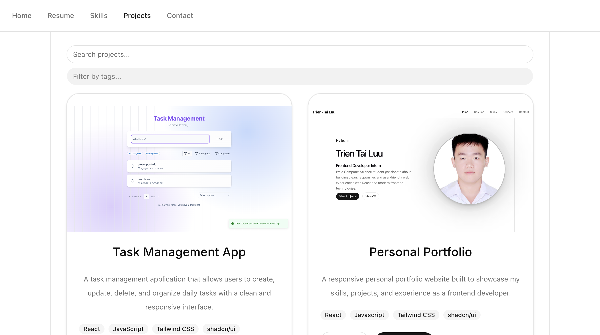
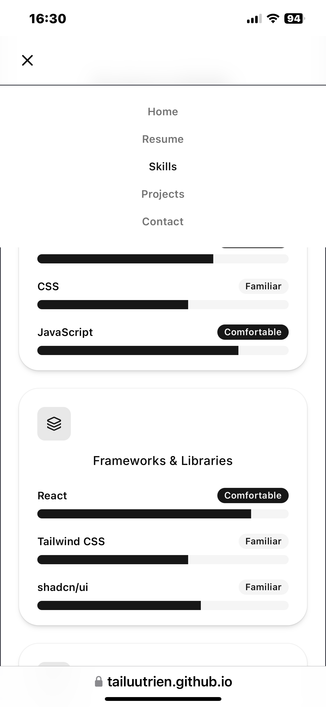

# Personal Portfolio

A responsive personal portfolio website built with React to showcase my profile, technical skills, resume, projects, and contact information.

## Tech Stack

- **React 19** — component-based frontend development
- **Vite** — development server and build tool
- **JavaScript**
- **Tailwind CSS 4** — utility-first styling
- **shadcn/ui / Base UI** — reusable UI components
- **React Router** — client-side routing
- **Motion** — page transition animations
- **Lucide React & React Icons** — icons
- **ESLint** — code linting

## Features

- Multi-page navigation with routes for:
  - Home
  - Resume
  - Skills
  - Projects
  - Contact
  - Custom 404 page
- Responsive layout for desktop and mobile devices
- Page transition animations
- Resume/CV viewing
- Technical and soft-skills presentation
- Project cards with:
  - Project screenshots
  - Technology badges
  - GitHub links
  - Live demo links when available
- Project search by project name
- Project filtering by multiple technology tags
- Contact form with client-side validation:
  - Required-field validation
  - Email format validation
  - Minimum message length
  - Character counter
  - Loading and success states
- Scroll-to-top behavior when navigating between pages

## Getting Started

### Prerequisites

Make sure you have **Node.js** and **npm** installed.

### Installation

Clone the repository:

```bash
git clone https://github.com/tailuutrien/portfolio.git
cd portfolio
```

Install dependencies:

```bash
npm install
```

Start the development server:

```bash
npm run dev
```

Vite will display the local development URL in your terminal, usually:

```text
http://localhost:5173
```

### Production Build

Create a production build:

```bash
npm run build
```

Preview the production build locally:

```bash
npm run preview
```

## Demo

Live Demo: https://tailuutrien.github.io/portfolio

## Screenshot

### Portfolio Preview



<p align="center">
  
</p>

## Author

**Trien Tai Luu**

- GitHub: https://github.com/tailuutrien
- Email: tai.luutrien@gmail.com
